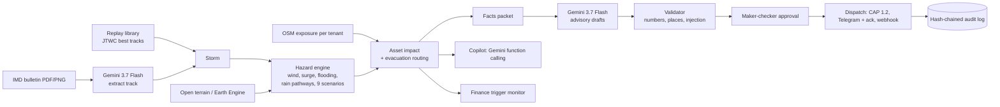

# CycloneShield AI

**Asset-level cyclone impact forecasting and advisory dispatch for disaster-management authorities - decision support downstream of IMD.**

Built for *Build with AI: Code for Communities - Second Edition* (Google Cloud x Hack2skill), **Track 05: Track-Based Cyclone Impact & Infrastructure Vulnerability Forecaster**.

> We do not forecast cyclones - IMD does. Given an official track, we answer what a district collector asks 72 hours before landfall:
> **which hospitals, power substations, roads and shelters get hit, by what (wind, sea water, rain), at what hour - and who must be told what, in which language.**
> Officers approve; then the advisory is dispatched with an audit trail.

**Decision support only. Not an official warning.** Official cyclone warnings come only from IMD; public alerts only from NDMA / SDMAs.

---

## What it does

1. **Reads** a storm: replays of real cyclones (JTWC best tracks: Hudhud, Fani, Amphan, Phailin, Michaung, Montha, ONE-26, Yagi), or an **official IMD bulletin PDF/image read by Gemini** into a validated track.
2. **Simulates** wind (Holland 1980), storm surge (screening-level storm-tide budget, calibrated per coast), sea-connected flooding on a DEM, and rain "damage pathways" (waterlogging basins and runoff corridors from priority-flood + D8 flow accumulation), with a **9-scenario what-if ensemble** (track +/-40 km, intensity +/-10 kt).
3. **Maps exposure** of real infrastructure from OpenStreetMap - hospitals, power substations and lines, arterial roads and bridges, candidate shelters - and produces an hour-by-hour **"what gets hit, when"** table, flood-safe **evacuation routes** with depart-by times, and an explicit "no route: shelter in place" verdict.
4. **Drafts advisories** per audience (collector, hospital, power company, roads, shelter managers, fisheries) in the officer's language. Every number is machine-checked against the model output.
5. **Dispatches** after **maker-checker approval** (two approvers for orange/red): CAP 1.2 file, Telegram message with an *Acknowledge* button, webhook - logged in a **hash-chained audit log**.
6. **Recommends early release** of a pre-arranged pool via IMD-stage-keyed anticipatory-finance tiers (a recommendation memo; no money moves).
7. **Scales by configuration**: each state or country is a JSON tenant file (Andhra Pradesh, Odisha and Vietnam are included).

## Where Google AI does real work

| Feature | Google product | What it does | Guardrail |
|---|---|---|---|
| Bulletin reader | **Gemini 3.7 Flash** (multimodal: PDF/PNG/text in, structured JSON out) | Turns an IMD bulletin (published only as PDF/image) into a track + surge sentence | Pydantic schema, range/unit/time-order checks, "extracted vs source" view |
| Advisory writer | **Gemini 3.7 Flash** (structured output) | Writes advisories from a facts packet; translates into Telugu, Odia, Hindi, Bengali, Tamil, Vietnamese... | Severity set by rules; numbers/places validated; retry, then labelled template fallback |
| Officer copilot | **Gemini 3.7 Flash** (function calling) | Answers questions by calling our tools (assets, roads, evacuation, surge, methodology) | No dispatch tool; numbers in answers checked against tool outputs |
| Geospatial live data | **Google Earth Engine** | Live NOAA GFS forecast rain, people (GHSL) and buildings (Open Buildings) in the modelled flood zone, map tiles | Fails soft: falls back to open terrain tiles |

The model ID is configurable (`GEMINI_MODEL`, default `gemini-3.7-flash`, the model the track names); a fallback chain is used if it is unavailable. `thinking_level` is set explicitly (Gemini 3 defaults to high) and temperature is left at its default. Every call is visible in the **AI trace** panel.

## What is real, and what is simulated or assumed

| Real | Simulated / assumed (and labelled as such in the product) |
|---|---|
| JTWC best tracks; OSM infrastructure; open terrain; IMD-style thresholds; Holland wind; hash-chained audit; CAP 1.2 generation; Telegram delivery (when a bot token is set); webhook delivery | Bulk SMS (needs TRAI DLT gateways), WhatsApp, Cell Broadcast and SACHET publishing (government-only) are **simulated**; CAP output is always `status=Exercise`, `scope=Restricted` with our own sender id |
| Gemini calls (when `GEMINI_API_KEY` is set) | Storm surge is **screening-level**: shelf geometry is hand-set and one multiplier per coast is **calibrated in-sample on a single event** (Hudhud 2014 for Andhra Pradesh, Fani 2019 for Odisha) - agreement with those observations is by construction, not a validation. Vietnam is uncalibrated |
| | Finance tier percentages and pool are illustrative design choices, not sourced values |
| | OSM is sparse for distribution poles and has almost no designated cyclone shelters; schools/halls are shown as *candidate* shelters |
| | R-CLIPER rain is a track-only prior (no orography); the DEM is a surface model biased high under buildings/trees, so flooding in built-up areas is under-predicted |

Full assumptions are listed in the app under **Trust -> Methodology** and in [`backend/app/exposure/impact.py`](backend/app/exposure/impact.py).

## Architecture



Stack: FastAPI (Python) serving a static single-page UI (Leaflet, no build step) from one **Cloud Run** service; Earth Engine via Application Default Credentials; state (advisories, audit chain) in files under `CYCLONESHIELD_STATE_DIR`.

## Quick start (local)

```bash
cd backend
python -m venv .venv && source .venv/bin/activate      # Windows: .venv\Scripts\activate
pip install -r requirements-dev.txt
cp .env.example .env                                   # add GEMINI_API_KEY etc. (all optional)
uvicorn app.main:app --port 8000                       # open http://localhost:8000
pytest -q                                              # 43 tests, no network needed
```

Without a Gemini key the app still runs end-to-end: advisories use the labelled deterministic template and the copilot / bulletin reader are disabled with a clear message.

Optional Earth Engine: register a Google Cloud project for Earth Engine, run `earthengine authenticate`, set `GOOGLE_CLOUD_PROJECT` in `.env`.

Regenerate data (only needed to add regions or refresh): `python scripts/build_replay.py`, `python scripts/fetch_osm.py <TENANT>`, `python scripts/prepare_tenant.py <TENANT>`, `python scripts/calibrate.py <TENANT>`.

**Deploy to Cloud Run:** see [docs/DEPLOY.md](docs/DEPLOY.md).

## Add a state or country

1. Copy `backend/app/tenants_data/IN-AP.json` and set `id`, `bbox` (south, west, north, east), `focus`, `languages`, `utc_offset_hours`, coast `sectors` (shelf width/depth, calibration `k`), `replay_storms`.
2. `python scripts/fetch_osm.py <ID>` then `python scripts/prepare_tenant.py <ID>`.
3. Optionally `calibrate.py` against an observed surge. No code changes. The tenant appears in the region selector.

## Repository layout

```
backend/app/
  storms/      JTWC/ATCF parsers, track interpolation, what-if scenarios
  hazard/      wind, surge, inundation, pluvial, rain, dem, gee (Earth Engine)
  exposure/    OSM assets, transparent impact rules, evacuation routing
  ai/          gemini_client, bulletin reader, facts + advisory + validator, copilot, trace
  dispatch/    CAP 1.2, hash-chained audit, Telegram/webhook channels, approval workflow
  engine.py    simulation orchestration + 9-scenario ensemble    finance.py  trigger monitor
  static/      single-page UI (Leaflet, vanilla JS modules)
  tenants_data/ one JSON per state/country
backend/data/  replay storms, OSM extracts (ODbL), terrain + hydrology caches
backend/tests/ 43 tests    backend/scripts/ data-preparation tools
```

## Data, licences and attribution

* Storm tracks: JTWC best-track archive via UCAR RAL (`hurricanes.ral.ucar.edu`). Reference observations carry their sources in `backend/data/storms/*.json`.
* Infrastructure: (c) OpenStreetMap contributors, ODbL 1.0 (the extracts under `backend/data/exposure`).
* Terrain: AWS/Mapzen Terrain Tiles (SRTM and other sources). Earth Engine layers: NOAA GFS, JRC GHSL P2023A, Google Open Buildings v3, MERIT Hydro - see each catalog page for terms.
* Methods: Holland (1980) wind profile; R-CLIPER rain (Tuleya et al. 2007); Emanuel (2011) loss sigmoid with the North Indian Ocean calibration shipped with CLIMADA (Eberenz et al. 2021); storm-tide budget after standard steady-state set-up formulae; CLIMADA's `TCSurgeBathtub` (Xu 2010) is used only as a cross-check reference (US-calibrated, not Indian).
* Code: MIT (see `LICENSE`).

## Responsible use

Every advisory carries a disclaimer; tiers are set by rules from IMD's four-stage warning clock and the modelled hazard; the LLM has no dispatch capability; orange/red need two approvers; CAP output is `Exercise`/`Restricted`; no personal data is processed; text from feeds and bulletins is treated as data, never as instructions.

## Project history

This repository began as a small UI prototype (four commits on 29 Sep 2026). The hazard engine, exposure pipeline, AI layer, dispatch workflow, tenants and UI were built during the hackathon period on top of that starting point; the earlier prototype's code has been replaced (see git history).
