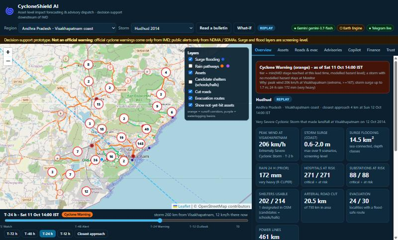
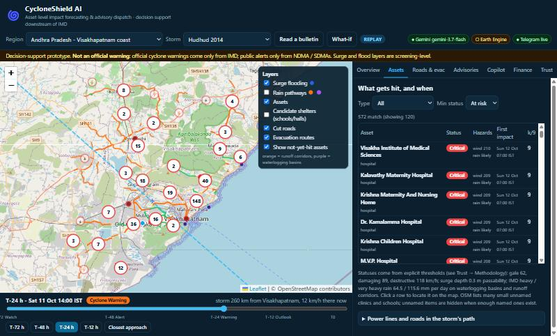
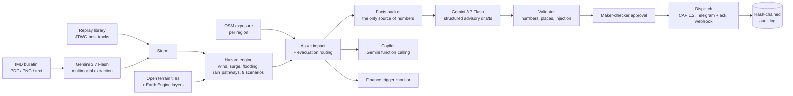

# CycloneShield AI

**Asset-level cyclone impact forecasting and advisory dispatch for disaster-management authorities: a decision-support layer that sits downstream of the India Meteorological Department (IMD).**

Built for *Build with AI: Code for Communities, Second Edition* (Google Cloud x Hack2skill), **Track 05: Track-Based Cyclone Impact & Infrastructure Vulnerability Forecaster**.

> **Decision support only. Not an official warning.** Official cyclone warnings come only from IMD; public alerts only from NDMA and the State Disaster Management Authorities (SDMAs). Every advisory this system produces carries that disclaimer.



---

## Contents

1. [The problem, in plain language](#1-the-problem-in-plain-language)
2. [What CycloneShield AI does, in plain language](#2-what-cycloneshield-ai-does-in-plain-language)
3. [A walk through one scenario](#3-a-walk-through-one-scenario)
4. [Key features](#4-key-features)
5. [How it fits into India's warning system](#5-how-it-fits-into-indias-warning-system)
6. [Architecture](#6-architecture)
7. [How it works, technically](#7-how-it-works-technically)
8. [Where Google AI and Google Cloud are used](#8-where-google-ai-and-google-cloud-are-used)
9. [Accuracy, validation and honest limitations](#9-accuracy-validation-and-honest-limitations)
10. [What is real and what is simulated](#10-what-is-real-and-what-is-simulated)
11. [Scaling across states and countries](#11-scaling-across-states-and-countries)
12. [Quick start](#12-quick-start)
13. [Configuration](#13-configuration)
14. [API reference](#14-api-reference)
15. [Deployment](#15-deployment)
16. [Repository layout](#16-repository-layout)
17. [Security and responsible AI](#17-security-and-responsible-ai)
18. [Data sources, licences and attribution](#18-data-sources-licences-and-attribution)
19. [Roadmap](#19-roadmap)
20. [Project history and status](#20-project-history-and-status)
21. [Glossary](#21-glossary)

---

## 1. The problem, in plain language

A cyclone is forecast days ahead. IMD publishes where it is expected to go and how strong it will be. That forecast is good, and India has become one of the world's best at using it: in 1999 the Odisha Super Cyclone killed roughly 10,000 people; in 2013 (Phailin) and 2019 (Fani), storms of similar or greater power killed a few dozen, because warnings were acted on early and millions of people were moved to safety.

But a forecast of *a storm* is not yet an answer to the questions a District Collector actually has, three days before landfall:

* **Which hospitals** will lose power or be cut off, and when?
* **Which power substations** will be flooded or hit by destructive wind?
* **Which roads** will be under water, so which evacuation routes will still work?
* **Which shelters** are safe to send people to, and by what time must people leave?
* **Who has to be told what**, in which language, and who signs off on the message?
* **Should relief money be released now**, before the storm lands, instead of after?

Today much of that work is manual: officers overlay forecast maps on asset lists, phone departments, and draft messages under time pressure. Acting *before* landfall (evacuation planning, hardening infrastructure, releasing pre-arranged funds) saves lives and livelihoods; acting *after* is recovery. This project is about closing the last step between "there is a forecast" and "everyone who must act knows what to do."

## 2. What CycloneShield AI does, in plain language

Think of it as **"a navigation app for a cyclone," built for the officers who have to respond**. It does **not** predict cyclones: IMD does that. It takes IMD's forecast and answers "so what, for *my* district, hour by hour?"

1. **It reads the storm.** Either a replay of a real past cyclone (so anyone can try it today) or an **official IMD bulletin (a PDF or image), read by Google's Gemini AI** and turned into a track.
2. **It works out what the storm will do to the ground:** how strong the wind is at each hospital, how high the sea will push water up the coast and how far inland it reaches, and where heavy rain will pool or run.
3. **It checks real infrastructure against that:** hospitals, power substations, power lines, main roads and shelters from OpenStreetMap, and produces a **"what gets hit, and when" table**, flood-safe evacuation routes with "leave before" times, and honest "no safe route, shelter in place" warnings.
4. **It drafts the messages.** One per audience (collector, hospital, power company, roads department, shelter managers, fishermen), in the officer's own language. Gemini writes; **computer code checks every number** before a person sees it.
5. **A human approves; then it is sent.** Two different officers must approve the serious (orange/red) ones. The message goes out (Telegram with an *Acknowledge* button, a machine-readable alert file, a webhook) and every step is written to a tamper-evident log.
6. **It suggests when to release money early**, using a transparent, pre-agreed trigger table. It is a recommendation memo only; no money moves.

The whole thing is honest about uncertainty: it shows ranges and "in how many of 9 what-if scenarios does this asset get hit," labels its estimates "screening-level," and says plainly what it does not know.

## 3. A walk through one scenario

*"What if Cyclone Hudhud, which hit Visakhapatnam in October 2014, came today, with today's hospitals, substations and roads?"*

| Step | What you do in the app | What you see |
|---|---|---|
| 1 | Open the app; region *Andhra Pradesh - Visakhapatnam*, storm *Hudhud 2014* | Storm track, hundreds of real hospitals, substations and shelters clustered on the map |
| 2 | Drag the **event clock** to *T-24 h* | The storm moves; the **warning tier turns orange by rule** (IMD's 24-hour "Cyclone Warning" stage plus the modelled hazard); assets light up as they are first hit |
| 3 | Open **Assets** | A table: each hospital and substation, its status, the hazards (wind, sea water, rain), the time of first impact and "hit in 9 of 9 scenarios" |
| 4 | Open **Roads & evac** | Which main roads are waterlogged, which localities have a flood-safe route to a shelter, the latest safe departure time, and which places are stranded |
| 5 | Open **Advisories**, pick *hospital* and *Telugu*, **Draft** | An advisory with green checks: numbers match the model, places are real, no injected text |
| 6 | **Submit**, then **Approve** as two different officers, then **Dispatch** | The message arrives on a phone (Telegram) with an **Acknowledge** button; pressing it marks the advisory acknowledged; the CAP alert file is shown |
| 7 | Open **Finance** | Which anticipatory-finance tier the forecast triggers and a draft release memo |
| 8 | Switch storm to **Montha 2025** (a near miss) | The tier stays **"Monitor - no action"**: the system does not cry wolf |
| 9 | Switch region to **Odisha** or **Vietnam** | The same pipeline runs for another state or country by configuration alone |

## 4. Key features

| Capability | Summary |
|---|---|
| **Multimodal bulletin reader** | Gemini turns an IMD bulletin (PDF/PNG/text) into a structured track; code validates ranges, units, time order; UI shows "extracted vs source" |
| **Hazard engine** | Holland wind field; storm-tide surge budget; sea-connected flood mapping on a DEM; rain pathways (waterlogging basins and runoff corridors); 9-scenario what-if ensemble |
| **Infrastructure exposure** | Hospitals, power substations and lines, arterial roads and bridges, candidate shelters from OpenStreetMap, with transparent, cited impact rules |
| **Evacuation routing** | Flood-aware shortest paths on the real road graph, "leave before" times, and explicit no-route verdicts |
| **Validated AI advisories** | Structured Gemini output, deterministic validator (numbers, places, injection), retry, then labelled template fallback; multilingual |
| **Officer copilot** | Gemini with function calling over our own tools; numbers in answers are checked against tool outputs |
| **Human-in-the-loop dispatch** | Maker-checker approval; CAP 1.2; Telegram with acknowledgement; webhook; hash-chained audit log |
| **Anticipatory finance** | IMD-stage-keyed trigger tiers and a release-recommendation memo (simulation only) |
| **Tenants as data** | Andhra Pradesh, Odisha, Vietnam included; a new region is a JSON file plus two data scripts |
| **Trust panel** | Methodology and assumptions, calibration disclosure, AI-call trace, audit-chain verification |
| **Resilient AI layer** | Model fallback chain, circuit breaker, latency budget, and a persistent cache of real Gemini outputs |



## 5. How it fits into India's warning system

India already runs a mature chain: IMD issues the four-stage cyclone warning; NDMA's **SACHET** platform (built on the Common Alerting Protocol) disseminates public alerts through SDMAs; IMD and NDMA's **Web-DCRA** provides district-level hazard atlases. CycloneShield AI is deliberately **not** a competitor to any of them:

```
IMD forecast ──► [ CycloneShield AI: asset-level impact, who-does-what-when, drafts ] ──► officer approval ──► SDMA / DEOC / departments
                                                                                          (CAP 1.2, Exercise/Restricted)         (SACHET publishing stays with authorised originators)
```

* We **consume** the official track (IMD bulletin via Gemini, or best-track/live feeds for demonstration).
* We **produce** CAP 1.2 files in the profile SACHET uses (`cap:` elements, `sent` with a +05:30 offset, `geocode valueName="LGD District Code"` when configured), always `status=Exercise` and `scope=Restricted` with our own sender id, so an authorised originator could ingest them. We never impersonate IMD or an SDMA and we never publish to public channels.
* The warning **tier** follows IMD's own four-stage clock: Pre-Cyclone Watch (72 h), Cyclone Alert (48 h), Cyclone Warning (24 h), Post-Landfall Outlook (12 h).

## 6. Architecture



**Stack:** Python 3.11 / FastAPI; NumPy, SciPy, NetworkX, Pillow; a static single-page UI (Leaflet, vanilla ES modules, no build step) served by the same FastAPI process; Google Gemini API (`google-genai`); Google Earth Engine (`earthengine-api`); deployable as **one container on Cloud Run**.

**Design principles**

1. **Numbers come from code, words come from the model.** Hazard and impact are deterministic; Gemini only reads, writes and explains.
2. **Every AI output is checked** before a person can act on it, and the checks are visible in the UI.
3. **A human approves anything that is sent.** The model has no dispatch capability.
4. **Fail soft and say so.** Each dependency (Gemini, Earth Engine, Telegram) has a labelled degraded mode.
5. **Config over code.** Regions, languages, thresholds and shelf geometry live in data files.

## 7. How it works, technically

### 7.1 Storm input (`app/storms/`)

* **Replay library**: eight real storms built from JTWC best-track files (UCAR RAL mirror): Hudhud 2014, Phailin 2013, Fani 2019, Amphan 2020, Michaung 2023, Montha 2025, ONE-26 (Sep 2026), Yagi 2024. `atcf.py` parses the ATCF b-deck format (lat/lon in tenths, knots, MSLP, 34/50/64-kt wind radii, radius of maximum wind) and the JTWC `.tcw` forecast format. Reference observations used for calibration or display carry a source URL and a confidence label.
* **Bulletin reader** (`app/ai/bulletin.py`): IMD publishes cyclone bulletins only as PDF/PNG. Gemini extracts a schema (`Bulletin`); deterministic code then normalises it: converts km/h to knots, drops implausible positions (outside 0-35N, 40-110E) or winds (outside 10-200 kt), orders times, and reports every issue. Any surge sentence in the bulletin is carried through as **official guidance** and shown next to our own estimate.
* **Track utilities** (`track.py`): interpolation, closest approach to a region's focus point (defines the event clock's T0), and **what-if scenarios** that shift the track sideways or change intensity (pressure is scaled consistently, Atkinson-Holland).
* Wind averaging periods are recorded per storm (JTWC 1-minute, IMD 3-minute); they are never silently mixed.

### 7.2 Hazard engine (`app/hazard/`, `app/engine.py`)

**Wind (`wind.py`)**: the Holland (1980) parametric profile:

```
p(r)  = pc + dp * exp(-(Rm/r)^B)
Vg(r) = sqrt( (B*dp/rho) * (Rm/r)^B * exp(-(Rm/r)^B) + (r*f/2)^2 ) - r*f/2
B     = rho * e * Vg_max^2 / dp          (clamped to 1.0 - 2.5)
surface wind = 0.85 * Vg, rotated 20 deg inward, + 0.5 x storm translation vector (right-of-track asymmetry)
```

`Rm` comes from the best track when present, otherwise a default by intensity (25-60 km). The 0.85, 20 degrees and 0.5 are standard-practice choices and are listed as assumptions in the app.

**Storm surge (`surge.py`)**: a screening-level *storm-tide budget* for each coastal sector:

```
storm tide = k * ( inverse barometer + wind set-up ) + tide
inverse barometer = 1 cm per hPa of pressure drop at the sector
wind set-up       = tau * L / (rho_w * g * h),   tau = rho_a * Cd * U_onshore^2,   Cd = min((0.75 + 0.067 U) * 1e-3, 2.5e-3)
```

`L` and `h` are the effective shelf width and mean depth of the sector; `U_onshore` is the wind component pointing inland (the inland direction is computed from the gradient of distance-to-sea on the DEM). Only the onshore side of the track contributes, so surge is asymmetric as it is in reality. The multiplier `k` is calibrated per coast (see [Section 9](#9-accuracy-validation-and-honest-limitations)). CLIMADA's `TCSurgeBathtub` formula (Xu 2010) is computed as a cross-check reference only.

**Flooding (`inundation.py`, `dem.py`)**: a *sea-connected, distance-attenuated bathtub* on a DEM built from open AWS/Mapzen Terrarium tiles (SRTM-derived, ~36 m). A cell floods when `elevation < storm_tide - 0.2 m/km x distance_from_sea` **and** it is hydraulically connected to the sea through other flooded cells (a plain bathtub floods inland depressions the sea cannot reach). Depth is reported in classes (<0.5, 0.5-1.5, >1.5 m), because DEM vertical error dominates surge error. Water bodies at or below 0 m are excluded; harbours whose entrance is narrower than one cell are merged into the sea.

**Rain pathways (`rain.py`, `pluvial.py`)**: R-CLIPER (Tuleya et al. 2007) gives a track-only rain rate; the 24-hour maximum is compared with IMD's classes (heavy 64.5, very heavy 115.6, extremely heavy 204.5 mm). Terrain decides *where* it matters: priority-flood depression filling (Barnes et al. 2014) finds **waterlogging basins** (closed depressions 0.5-3 m deep; stricter thresholds in flat deltas where DEM noise exceeds shallow depressions), and D8 flow accumulation finds **runoff corridors** (>= 0.5 km2 upstream). A *damage pathway* is source, water path, receptor (an asset), onset time.

**Ensemble (`engine.py`)**: nine members (track -40/0/+40 km x intensity -10/0/+10 kt). Each asset reports `k of 9`: the share of scenarios in which it is hit. This is a spread, not a calibrated probability.

### 7.3 Exposure and impact (`app/exposure/`)

* **Assets** come from OpenStreetMap extracts prepared offline (`scripts/fetch_osm.py`; the app never calls Overpass at runtime): hospitals, power substations, power lines, arterial roads and bridges, candidate shelters (schools and halls unless designated), and localities (as evacuation origins). Ways are clipped to the study area.
* **Impact rules** (`impact.py`) are explicit thresholds. Wind bands aligned with IMD classes: gale 62, damaging 89, destructive 118, extreme 167 km/h. Surge depth: 0.3 m makes a road impassable (vehicle-passability threshold, after Pregnolato et al. 2017); 0.5 m critical for a substation; 1.0 m critical for a hospital. Rain: IMD heavy/very-heavy on waterlogging basins gives *possible/likely* waterlogging. Status is one of ok / watch / at risk / critical, with the reasons listed. Shelters are made unusable only by flooding (they exist to ride out wind); non-designated candidates are flagged at extreme wind.
* **Expected loss ratio** (used for finance): the Emanuel (2011) sigmoid `f = v^3/(1+v^3)`, `v = (V - 25.7)/(V_half - 25.7)`, with the North-Indian-Ocean `V_half = 58.7 m/s` from the calibration shipped with CLIMADA (Eberenz et al. 2021). It is an aggregate expected fraction of exposed value, near zero below ~50 kt; it is **not** a structural failure probability for any one building.
* **Routing** (`routing.py`): NetworkX on the OSM road graph (edges weighted by class-based free-flow speed). Nodes are blocked at flood depth >= 0.3 m or in waterlogging basins under very heavy rain. Multi-source Dijkstra from all *safe* shelters gives each locality its nearest reachable one; "leave before" = local gale onset minus travel time minus a 1 h buffer. A locality with no route gets an explicit *shelter in place / request assistance* verdict rather than a blank.

### 7.4 Warning tier: rules, not the LLM (`app/ai/facts.py`)

```
tier = min( IMD stage reached at this lead time,  modelled hazard level )
```

A storm with no modelled hazard stays at **Monitor - no action** regardless of the clock. The tier drives the wording of advisories, the number of approvers and the finance tier. The LLM never sets severity.

### 7.5 AI layer (`app/ai/`)

| Module | Role |
|---|---|
| `gemini_client.py` | One wrapper for every model call: fallback chain (`gemini-3.7-flash`, then 3.6, then 3.5-flash-lite), explicit `thinking_level` (Gemini 3 defaults to high; `MINIMAL` is unsupported on 3.7 so it is served as `LOW`), default temperature (Gemini 3 guidance), retries with a **circuit breaker** (a model that returns 429/503 is skipped for a while) and a 75 s overall budget, structured output via `response_schema`, tool use via automatic function calling, and a trace record for every call |
| `facts.py` | Builds the **facts packet**: the *only* source of numbers an advisory may contain, with an audience-specific view (collector, hospital, power, roads, shelter, fisheries) |
| `advisory.py` | Facts packet, then Gemini structured draft, then validator, then optional translation (validated again), then officer approval. Retry once with the validator's feedback; then a **labelled deterministic template** |
| `validator.py` | Deterministic guardrails (below) |
| `copilot.py` | Gemini with function calling over `get_overview`, `list_assets_at_risk`, `list_road_impacts`, `evacuation_status`, `sector_surge`, `explain_method`, `draft_advisory_preview`; tools never raise into the model; answers are number-checked against tool outputs; there is **no dispatch tool** |
| `bulletin.py` | Multimodal ingestion (7.1) |
| `aicache.py` | Persistent cache of real Gemini outputs (7.6) |
| `trace.py` | Ring buffer behind the UI's "AI trace" panel |

**Validator checks** (every draft, every translation): (1) every number appears in the facts packet, or is a rounded variant of one, or is a documented threshold (digits in any script are normalised first: Telugu, Odia, Devanagari...); (2) every named place or asset exists in the model output; (3) no URLs, phone numbers or instruction-like text ("ignore previous instructions"); (4) an uncertainty statement is present; (5) the schema is complete. Google's own structured-output documentation says to "always validate values in your application": a schema guarantees syntax, not truth.

### 7.6 Persistent AI cache (`aicache.py`)

Model quota and credits can run out, or a new model can be overloaded, exactly when someone evaluates a prototype. Every *real* Gemini output is stored keyed by the SHA-256 of the exact facts packet it was written from. On a later request for identical facts it can be served again, **re-validated against the current facts**, labelled "(cached)" with its model and date, and always regenerable live. A tampered cache file is rejected by the validator. Nothing is ever faked: with no cache entry and no working model, the labelled template is used. `scripts/prime_ai_cache.py` fills the cache, paced for free-tier limits.

### 7.7 Dispatch (`app/dispatch/`)

* **Workflow** (`workflow.py`): `DRAFT -> PENDING_APPROVAL -> APPROVED -> DISPATCHED -> ACKED`, plus `REJECTED` and `CANCELLED`. **Maker-checker**: the approver must differ from the maker; **orange and red need two distinct approvers**. Officers can edit a draft; edits are re-validated and clear approvals.
* **CAP 1.2** (`cap.py`): Common Alerting Protocol XML in the SACHET profile, always `Exercise` / `Restricted`, own sender id, disclaimer in `<note>`, a recommended area polygon, an optional second `<info>` in the officer's language, and `Cancel` messages that reference the original. A structural safety check runs before every dispatch.
* **Channels** (`channels.py`): **Telegram** (message + CAP file + inline *Acknowledge* button; a press marks the advisory acknowledged and is logged) and **webhook** POST are real. **SMS** (TRAI DLT gateways), **WhatsApp** and **Cell Broadcast** are government/telecom-gated and are *simulated and labelled*.
* **Audit log** (`audit.py`): append-only and **hash-chained**. Each entry commits to the previous entry's hash, so editing or deleting any earlier entry breaks every later hash and `verify()` reports where. This is *tamper-evident against non-re-chained edits*; for stronger guarantees anchor the head in a retention-locked bucket and sign entries with Cloud KMS. We call it an "append-only hash-chained audit log", never a blockchain or "tamper-proof".

### 7.8 Anticipatory finance (`app/finance.py`)

Design references: CCRIF (pays when *modelled* loss reaches an attachment point, within 14 days) and the IFRC/Bangladesh Red Crescent cyclone Early Action Protocol (pre-agreed funds released on a wind forecast above 125 km/h at ~30 h lead time). The monitor keys four **cumulative tiers** to IMD's stage clock: T0 Readiness 10 %, T1 Alert 35 %, T2 Warning 75 %, T3 Landfall 100 % of a pre-arranged pool, each with its hazard condition. It shows which conditions are met, drafts a release-recommendation memo, lists **basis risk** (a modelled trigger can fire without loss, or miss loss), and requires a human to approve. **No money moves.** The tier percentages and the pool are illustrative design choices, labelled as such.

## 8. Where Google AI and Google Cloud are used

| Feature | Google product | What it does | Guardrail |
|---|---|---|---|
| Bulletin reader | **Gemini 3.7 Flash**: multimodal input (PDF / image / text), structured JSON output | Turns an IMD bulletin into a track and a surge sentence | Schema, range/unit/time checks, "extracted vs source" view |
| Advisory writer | **Gemini 3.7 Flash**: structured output | Drafts audience-specific advisories; translates them into Telugu, Odia, Hindi, Bengali, Tamil, Vietnamese... | Tier by rules; numbers/places validated; retry then labelled template |
| Officer copilot | **Gemini 3.7 Flash**: function calling | Answers questions by calling our analysis tools | No dispatch tool; numbers checked against tool outputs |
| Live geospatial data | **Google Earth Engine** | NOAA GFS forecast rain (`NOAA/GFS0P25`); people (`JRC/GHSL/P2023A/GHS_POP`) and buildings (`GOOGLE/Research/open-buildings/v3/polygons`) inside the modelled flood zone; tile layers (GFS rain, MERIT Hydro HAND, population) | Fails soft to open terrain tiles; needs a registered Cloud project |
| Hosting | **Cloud Run**, Cloud Build, Secret Manager | One container serves API and UI | See [docs/DEPLOY.md](docs/DEPLOY.md) |

The model ID is configurable (`GEMINI_MODEL`, default `gemini-3.7-flash`, the model the track names). Every Gemini call is visible in **Trust, AI trace** with its model, latency, tool calls and whether a fallback was used.

## 9. Accuracy, validation and honest limitations

**What is checked automatically:** 54 automated tests cover the parsers, physics (for example, the Holland peak matches the reported maximum wind within 5 % and sits at the radius of maximum wind; surge worked examples), the API, the validator (rejecting invented numbers, injected text and unknown names), the approval rules, CAP safety fields, audit tamper detection, finance tiers, bulletin normalisation and the AI cache (including tamper rejection).

**Surge calibration: read this carefully.** The screening model has hand-set shelf geometry and **one multiplier `k` per coast, calibrated on a single observed event**: Andhra Pradesh on Hudhud 2014 (1.2-1.4 m at the Visakhapatnam tide gauge), giving `k = 2.0`; Odisha on Fani 2019 (about 1.5 m reported; INCOIS guidance days earlier was up to ~4 m), giving `k = 0.65`. Because the multiplier was *fitted* to those observations, agreement with them is **by construction and is not a validation**. The two coasts needing very different multipliers shows that the hand-set shelf geometry is the weak part. Vietnam is **uncalibrated**. The product states all of this in **Trust, Calibration** and never presents surge as an official forecast (IMD/INCOIS run the operational models).

**Other limitations**

* **Terrain**: the DEM is a surface model biased high under buildings and trees, so flooding in built-up areas is **under-predicted**; depth is shown in classes for that reason.
* **Rain**: R-CLIPER has no orography and under-predicts stalled or monsoon-interacting events (for example Michaung over Chennai). It is a scenario prior, not a forecast.
* **OpenStreetMap coverage** is uneven: good for high-voltage lines, main roads and urban hospitals; poor for distribution poles (where most outages occur) and for designated cyclone shelters. Schools and halls are shown as *candidate* shelters and shelter capacity is not modelled. Odisha and Vietnam extracts are thinner than Andhra Pradesh.
* **Winds** are on the source's averaging basis (JTWC 1-minute runs a few percent above IMD 3-minute).
* **Loss ratio** is an aggregate expected fraction, near zero for weak storms, not a per-building failure probability.
* **Shelter capacity, traffic, drainage networks, tide-locking of outfalls and wave run-up** are not modelled.
* **Storm replays use best-track data** (hindsight); in live use the same pipeline consumes an official *forecast*, whose errors the 9-scenario ensemble only partly represents.
* Media-reported damage figures for past storms (for example Fani) are labelled as such and were not independently verified.

## 10. What is real and what is simulated

| Real | Simulated or assumed (and labelled in the product) |
|---|---|
| JTWC best tracks; OSM infrastructure; open terrain; IMD-style thresholds; Holland wind; hash-chained audit; CAP 1.2 generation; Telegram delivery (with a bot token); webhook delivery; Gemini calls (with a working key) | **SMS, WhatsApp, Cell Broadcast, SACHET publishing** are government/telecom-gated and simulated; CAP output is always `Exercise`/`Restricted` |
| The approval workflow, validator and guardrails | Storm surge is screening-level with in-sample calibration; finance percentages and pool are illustrative; live cyclone feeds are not wired (replay and bulletin are the inputs); tide is a configured assumption |

## 11. Scaling across states and countries

A region ("tenant") is a JSON file in `backend/app/tenants_data/`: study-area bounding box, focus point, languages, time zone, coast sectors (shelf width and depth, calibration `k`), recipient roles, replay storms, calibration event and attribution. Included: **IN-AP** (Visakhapatnam coast), **IN-OR** (Puri coast), **VN** (Hai Phong, a cross-border demonstration on Typhoon Yagi). The core model uses only global inputs (best tracks, open terrain, OSM, Earth Engine layers), so it is basin-agnostic: the same code handles the North Indian Ocean and the West Pacific. India-specific parts (IMD bulletins, LGD district codes, CAP profile, IMD stage clock) sit at the edges.

**Add a region**

1. Copy an existing tenant file and edit it.
2. `python scripts/fetch_osm.py <ID>` then `python scripts/prepare_tenant.py <ID>`.
3. Optionally calibrate: `python scripts/calibrate.py <ID>`.
4. Restart; the region appears in the selector. No code changes.

**Pilot pathway (proposal)**: week 1, shadow mode with one SDMA on a district; weeks 2-3, a second state (a new tenant file, a language pack and one data run); week 4, a CAP feed to a state EOC or the SACHET test channel via NDMA. Note that Earth Engine is free for non-commercial use only, so a state or ministry pilot would probably need paid Earth Engine, and Gemini 3.7 Flash's introductory pricing changes on 1 Jan 2027.

## 12. Quick start

```bash
git clone https://github.com/just-deva/cycloneshield-ai.git && cd cycloneshield-ai
cd backend
python -m venv .venv
source .venv/bin/activate                 # Windows: .venv\Scripts\activate
pip install -r requirements-dev.txt
cp .env.example .env                      # every key is optional (see Configuration)
uvicorn app.main:app --port 8000          # open http://localhost:8000
pytest -q                                 # 54 tests, no network needed
```

Without any keys the app still runs end to end: advisories use the labelled deterministic template (or cached real Gemini output if present), the copilot and bulletin reader report "Gemini unavailable" clearly, dispatch is simulated and labelled.

**Regenerate or extend data:** `python scripts/build_replay.py` (storms), `scripts/fetch_osm.py <ID>` (infrastructure), `scripts/prepare_tenant.py <ID>` (terrain and hydrology caches), `scripts/calibrate.py <ID>` (surge multiplier), `scripts/prime_ai_cache.py` (cache real Gemini outputs).

## 13. Configuration

Set in `backend/.env` (never commit it) or as environment variables / Cloud Run secrets.

| Variable | Purpose | Default |
|---|---|---|
| `GEMINI_API_KEY` | Gemini API key (paid-tier key recommended for a public demo) | none: template / cache mode |
| `GEMINI_MODEL` | Primary model | `gemini-3.7-flash` |
| `GEMINI_FALLBACK_MODELS` | Fallback chain | `gemini-3.6-flash,gemini-3.5-flash-lite` |
| `GOOGLE_CLOUD_PROJECT` | Project registered for Earth Engine | none |
| `EE_ENABLED` | `false` disables Earth Engine | `auto` |
| `TELEGRAM_BOT_TOKEN`, `TELEGRAM_CHAT_ID` | Real advisory delivery + acknowledgements | none: simulated |
| `TELEGRAM_WEBHOOK_SECRET` | Secret for the Telegram webhook | `cycloneshield` |
| `TELEGRAM_POLLING` | `true` polls for button presses (local dev) | `false` |
| `DISPATCH_WEBHOOK_URL` | Where CAP files are POSTed | the app's own `/api/mock-deoc` |
| `CYCLONESHIELD_DATA_DIR`, `CYCLONESHIELD_STATE_DIR` | Data and runtime-state locations | `backend/data`, `backend/data/state` |

## 14. API reference

Interactive documentation is served at `/docs` (OpenAPI). Main endpoints:

| Area | Endpoints |
|---|---|
| Status | `GET /api/health`, `GET /api/gee/status`, `GET /api/ai-cache`, `GET /api/trace` |
| Regions and storms | `GET /api/tenants`, `GET /api/storms`, `GET /api/storms/{id}` |
| Simulation | `POST /api/simulate` (`tenant_id`, `storm_id`, `cross_track_km`, `delta_kt`, `tide_m`, `ensemble`), `GET /api/layers/{sim_id}/inundation.png`, `GET /api/layers/{tenant}/pathways.png`, `GET /api/severity/{sim_id}` |
| Trust | `GET /api/methodology`, `GET /api/calibration/{tenant}`, `GET /api/audit`, `GET /api/audit/verify` |
| Advisories | `POST /api/advisories/draft`, `GET/PATCH /api/advisories/{id}`, `POST .../submit`, `.../approve`, `.../reject`, `.../dispatch`, `.../ack`, `.../cancel`, `GET .../cap.xml` |
| AI | `POST /api/copilot`, `POST /api/bulletin/extract` (file), `POST /api/bulletin/extract-text` |
| Finance | `GET /api/finance/{sim_id}?lead_h=&pool_crore=`, `POST /api/finance/{sim_id}/approve` |
| Earth Engine | `GET /api/gee/summary/{sim_id}`, `GET /api/gee/tiles/{tenant}` |
| Telegram / demo | `POST /api/telegram/webhook`, `POST /api/telegram/setup`, `GET /api/telegram/status`, `POST /api/mock-deoc` |

## 15. Deployment

One container, one URL: the FastAPI service serves the API and the UI, so there is no CORS and no API-URL build variable. A `Dockerfile` is included; deploy with Cloud Build via `gcloud run deploy --source .` from Cloud Shell (no local Docker needed). Full step-by-step instructions (project, billing, Earth Engine registration and IAM roles, secrets, Telegram webhook, verification, troubleshooting) are in **[docs/DEPLOY.md](docs/DEPLOY.md)**. Use `--max-instances 1` so the in-memory simulation cache and the file-based audit chain stay consistent; a production system would use Firestore and a retention-locked bucket. The submission checklist, demo script and pitch outline are in [docs/SUBMISSION.md](docs/SUBMISSION.md).

## 16. Repository layout

```
backend/
  app/
    main.py, routes.py, config.py, engine.py, finance.py
    storms/        ATCF/JTWC parsers, track interpolation, what-if scenarios
    hazard/        wind, surge, inundation, pluvial, rain, dem, gee (Earth Engine)
    exposure/      OSM assets, transparent impact rules, evacuation routing
    ai/            gemini_client, bulletin, facts, advisory, validator, copilot, aicache, trace
    dispatch/      cap (CAP 1.2), audit (hash chain), channels (Telegram/webhook), workflow
    static/        single-page UI (Leaflet, vanilla ES modules)
    tenants_data/  one JSON file per region
  data/            replay storms, OSM extracts (ODbL), terrain + hydrology caches, AI cache
  scripts/         build_replay, fetch_osm, prepare_tenant, calibrate, prime_ai_cache
  tests/           54 automated tests
docs/              DEPLOY.md, SUBMISSION.md, images/
Dockerfile         one-container Cloud Run image
```

## 17. Security and responsible AI

* **Secrets** live only in `.env` / Cloud Run secrets; `.env` is git-ignored. Rotate any key that has been shared.
* **Human in the loop:** the model can draft but never dispatch; dispatch is code behind a maker-checker state machine (two approvers for orange/red).
* **Untrusted text** (bulletins, feeds, OSM names) is treated as data, never as instructions; outputs are checked for injected instructions, URLs and phone numbers; all inserted text in the UI is HTML-escaped.
* **CAP safety:** always `Exercise`/`Restricted`, never an SDMA/IMD sender; checked before every dispatch.
* **No personal data** is processed; tenant configs contain role placeholders, never real officials' contact details.
* **Transparency:** every AI call, cached answer, fallback and validation result is visible in the UI.
* **Disclaimer** on every advisory, CAP `<note>` and screen: decision support, not an official warning.

## 18. Data sources, licences and attribution

* **Storm tracks:** JTWC best-track archive via the UCAR RAL open mirror (`hurricanes.ral.ucar.edu`). Reference observations (Hudhud, Phailin, Fani, Amphan, Michaung) carry their sources in `backend/data/storms/*.json`.
* **Infrastructure:** (c) OpenStreetMap contributors, ODbL 1.0: the extracts under `backend/data/exposure` are ODbL-licensed derived data.
* **Terrain:** AWS/Mapzen Terrain Tiles (SRTM and other sources). Earth Engine layers (NOAA GFS, JRC GHSL P2023A, Google Open Buildings v3, MERIT Hydro) carry their own terms; see each catalog page.
* **Methods:** Holland (1980) wind profile; R-CLIPER rain (Tuleya, Demaria and Kuligowski 2007); priority-flood depression filling (Barnes, Lehman and Mulla 2014); Emanuel (2011) loss function with the North-Indian-Ocean calibration in CLIMADA (Eberenz, Luthi and Bresch 2021); vehicle passability threshold after Pregnolato et al. (2017); CLIMADA's `TCSurgeBathtub` (Xu 2010) as a cross-check only.
* **Standards:** OASIS Common Alerting Protocol 1.2; IMD four-stage cyclone warning system.
* **Code:** MIT (see `LICENSE`).

## 19. Roadmap

* Live forecast ingestion (IMD-authoritative; GDACS / JTWC forecast files as supplements) alongside replay and bulletin input.
* Derive shelf width and depth from bathymetry instead of hand-set values; out-of-sample validation against Sentinel-1 flood maps for past events.
* NWP rainfall (GFS/ECMWF ensembles) blended with R-CLIPER; Google WeatherNext cyclone ensembles for the uncertainty cone.
* Designated cyclone-shelter registers and Health Facility Registry integration; shelter capacity.
* Firestore state, KMS-signed and bucket-anchored audit chain; SDMA-originator integration through NDMA.
* Bhashini language adapters; voice bulletins; roof/material classification from field photos (Gemini vision).

## 20. Project history and status

This repository began as a small UI prototype (four commits on 29 Sep 2026). The hazard engine, exposure pipeline, AI layer, dispatch workflow, tenants and UI were built during the hackathon period on top of that starting point, and the earlier prototype's code has been replaced (see the git history; the original `main` branch preserves it).

**Status:** working end to end on real data and tested (54 tests). Integrations that need credentials degrade gracefully when they are absent: Gemini (template / cached output), Earth Engine (open terrain), Telegram (simulated dispatch). Earth Engine requires the Google Cloud project to be registered for it; Gemini requires a key with available quota.

## 21. Glossary

| Term | Meaning |
|---|---|
| **Storm surge / storm tide** | Sea-level rise pushed onto the coast by a storm's low pressure and onshore wind; storm tide adds the normal tide |
| **Landfall / closest approach** | When the storm centre reaches land / is nearest a place; the app's event clock is measured from closest approach to the region's focus point ("T0") |
| **IMD stages** | Pre-Cyclone Watch (72 h), Cyclone Alert (48 h), Cyclone Warning (24 h), Post-Landfall Outlook (12 h) |
| **Best track** | An agency's after-the-fact analysis of a storm's position and intensity |
| **DEM** | Digital elevation model, a grid of ground heights |
| **Waterlogging basin / runoff corridor** | A closed low spot where rain water collects / a channel where it concentrates and flows |
| **CAP** | Common Alerting Protocol, the international XML standard for alerts; India's SACHET uses it |
| **SACHET, Web-DCRA** | NDMA's CAP-based alert dissemination platform / IMD-NDMA's district hazard atlas |
| **SDMA / DEOC / DDMA** | State Disaster Management Authority / District Emergency Operations Centre / District DMA |
| **Maker-checker** | One person prepares, a different person approves |
| **Anticipatory action / parametric trigger** | Releasing pre-agreed funds or actions when a forecast crosses a threshold, before damage occurs |
| **Basis risk** | The chance a trigger fires with no loss, or misses a loss that occurs |
| **Facts packet** | The set of computed numbers an advisory is allowed to use; everything else is rejected |

---

**Disclaimer.** CycloneShield AI provides decision-support advisories generated with AI from public forecasts and models. It is **not** an official warning. Official cyclone warnings are issued only by the India Meteorological Department, and public alerts only by NDMA and SDMAs through authorised channels. Estimates carry uncertainty. Always act on the latest IMD bulletin and the instructions of your district administration. Financial figures are indicative recommendations, not an insurance contract or payment instruction.
